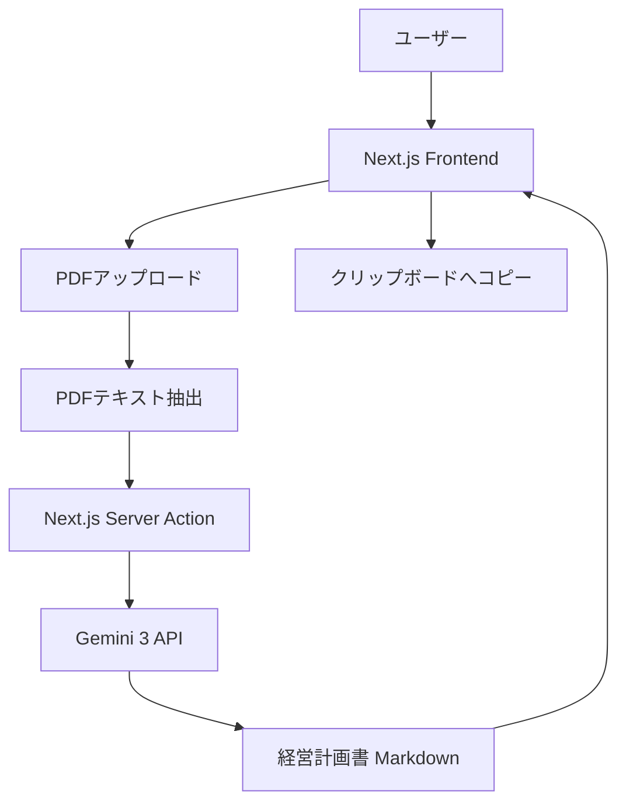

# 経営計画書作成アプリ 開発プラン

## 概要
ユーザーがアップロードしたインタビューシート（PDF）を読み取り、Gemini 3 APIを使用してプロフェッショナルな経営計画書を自動生成するNext.jsアプリケーション。

## 技術スタック
- **Framework**: Next.js (App Router)
- **Language**: TypeScript
- **Styling**: Tailwind CSS
- **AI SDK**: `@google/generative-ai` (Gemini 3)
- **PDF Parsing**: `pdf-parse` または `pdfjs-dist`
- **Markdown Rendering**: `react-markdown`

## システム構成図

## 主要コンポーネント
1. **FileUploader**: PDFファイルの選択とバリデーション。
2. **PlanGenerator**: 「作成」ボタンと生成ステータスの管理。
3. **MarkdownViewer**: 生成されたMarkdownを綺麗に表示。
4. **CopyButton**: 生成結果をGoogleドキュメント等に貼り付けやすくするためのコピー機能。

## 実装のポイント
- **プロンプト管理**: ユーザーから提供された詳細なプロンプトをサーバーサイドで保持し、抽出したテキストを埋め込む。
- **エラーハンドリング**: PDFの読み取り失敗やAPIのタイムアウトに対する適切なフィードバック。
- **セキュリティ**: APIキーは環境変数（`.env.local`）で管理し、クライアントサイドには露出させない。

## 完了後の案内（要件通り）
生成完了後、以下のメッセージを表示する：
> この経営計画書は、Googleドキュメントに貼り付けてお使いいただける形式で作成しました。このままテキスト全体をコピー＆ペーストして保存されることをおすすめします。Wordで出力したい場合は、一旦Googleドキュメントに貼り付け、その後『ファイル』＞『ダウンロード』＞『Microsoft Word（.docx）』を選択すると、きれいに保存できます。スライドにしたい場合は、ご自身で作成されるか、この計画書を原稿として専門業者に依頼されてみてください。
> なお、本内容はAIが業界知識やヒアリングシートに基づき作成した『参考情報』です。経営実態との相違がないか必ずご自身で内容を確認・修正し、正確性を高めた上でご活用ください。本資料の利用に関する最終的な判断と責任は、利用者様に帰属いたします。
